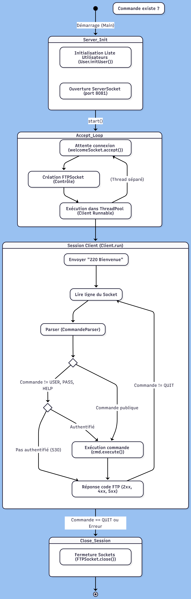
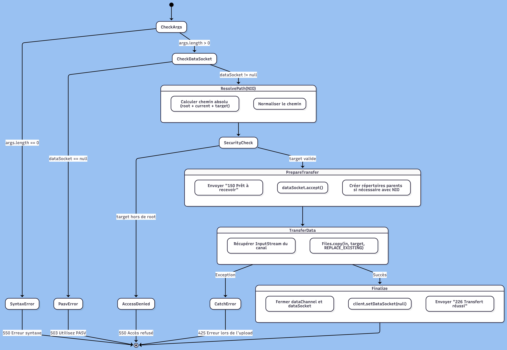

# Serveur FTP

**Auteur :** Assane Kane  
**Date :** 12/02/2026

## Introduction

Ce logiciel est un serveur FTP (File Transfer Protocol) conforme à la RFC 959, développé en Java. Il permet de gérer plusieurs connexions simultanées pour naviguer dans un système de fichiers, gérer des répertoires, et effectuer des transferts de données (upload/download) via le mode passif. Le serveur intègre un système d'authentification avec "anonymous" et une sécurité de type "Root Jail" pour isoler les utilisateurs dans le répertoire racine du projet.

## Instructions de build et d'exécution

### Compilation avec Maven

Pour compiler et empaqueter le serveur, exécutez la commande suivante à la racine du projet :
```bash
mvn clean package
```

Cette commande génère le fichier `FTPServer-1.0-SNAPSHOT.jar` dans le dossier `target/`.

### Exécution du serveur

Pour lancer le serveur sur le port par défaut (8081) :
```bash
java -jar target/FTPServer-1.0-SNAPSHOT.jar
```

Le serveur démarre et affiche :
```
Serveur FTP en attente sur le port 8081...
```

## Tests unitaires

Le projet utilise JUnit 5 et Mockito pour garantir la stabilité du serveur.

### Tests des sockets et du réseau

**Tests de `FTPSocket` :**
- `accept()` : Vérifie la création correcte d'un canal de données après une connexion entrante via un `ServerSocket` mocké.
- `close()` : Garantit la libération totale des ressources (sockets et flux) et la mise à null des références pour éviter les fuites mémoire.
- `isClosed()` : Vérifie l'état de fermeture cohérent entre les sockets clients et serveurs.
- `write()` / `read()` : Testent l'envoi et la réception de commandes textuelles sur le canal de contrôle.
- `getInputStream_Interdit_Sur_ControlChannel()` : Vérifie que l'accès aux flux binaires est correctement bloqué sur le canal de contrôle.

**Tests de `FTPServer` :**
- `testServeurStartAndAcceptConnection()` : Vérifie que le serveur démarre correctement, accepte les connexions entrantes et envoie le message d'accueil `220`.

### Tests des commandes

**Tests d'authentification (COMMANDETests) :**
- `testUSER()` : Vérifie que la commande USER stocke correctement le nom d'utilisateur et retourne le code 331.
- `testPASS_Success()` : Teste la séquence complète d'authentification et le changement d'état du client vers `authenticated = true`.

**Tests de navigation :**
- `testCWD_Success()` : Teste le changement de répertoire avec résolution correcte des chemins relatifs et absolus.
- `CDUPTest()` : Vérifie la remontée au répertoire parent (`..`).
- `testPWD()` : Teste l'affichage du répertoire courant.

**Tests de manipulation de fichiers :**
- `testDELE_Success()` : Vérifie la suppression physique des fichiers sur le disque avec `Files.delete()`.
- `testRMD_Success()` : Vérifie la suppression physique des dossiers.
- `testRenameProcess()` : Teste le protocole en deux étapes RNFR (source) puis RNTO (destination) avec vérification physique du renommage.
- `testMDTM_Success()` : Vérifie le retour de la date de modification au format UTC.

**Tests de prérequis :**
- `testLIST_RequiresPasv()` / `testNLST_RequiresPasv()` : Vérifient que les commandes de listage retournent une erreur 503 si PASV n'a pas été appelé au préalable.

Les tests utilisent `@TempDir` pour simuler un système de fichiers réel sans altérer les données de l'hôte et `System.setProperty("user.dir", ...)` pour stabiliser la racine du serveur durant les tests. Mockito est utilisé pour simuler les interactions réseau sans nécessiter de connexions réelles.

## Architecture

### Classes principales

**FTPServer** : Point d'entrée réseau. Il initialise le `ServerSocket` sur le port 8081 et utilise un `ExecutorService` (pool de 100 threads) pour gérer les connexions concurrentes. Chaque client accepté est encapsulé dans une instance de `Client` qui est soumise au pool de threads.

**Client** : Implémente `Runnable`. Cette classe représente une session utilisateur complète. Elle maintient l'état du client (authentification, répertoire courant, socket de données) et invoque les commandes via une `Map<String, FTPCommande>` qui associe chaque commande FTP à son implémentation.

**FTPSocket** : Abstraction des sockets Java. Elle gère intelligemment la distinction entre le canal de contrôle (texte via `BufferedReader`/`PrintWriter`) et le canal de données (binaire via `BufferedInputStream`/`BufferedOutputStream`). Cette séparation empêche les conflits de flux et assure la stabilité des transferts.

**CommandeParser** : Classe utilitaire statique qui analyse les chaînes brutes reçues du client (ex: `"USER admin"`) pour extraire la commande FTP et ses arguments dans un objet `FTPRequest`.

**User** : Modèle métier gérant la base de données locale des utilisateurs. Contient la logique de validation des credentials avec support de l'accès `anonymous` sans mot de passe.

**FTPCommande** : Interface définissant le contrat `execute(String[] args, Client client)` que toutes les commandes doivent implémenter. Permet l'ajout de nouvelles fonctionnalités par simple création d'une classe et ajout dans la `Map` de `Client`.

### Commandes implémentées

Le serveur supporte un large éventail de commandes RFC 959 :

**Accès et session :**
- `USER` : Identification de l'utilisateur
- `PASS` : Authentification par mot de passe
- `QUIT` : Fermeture propre de la session
- `HELP` : Affichage des commandes disponibles
- `SYST` : Information sur le système d'exploitation

**Navigation :**
- `PWD` : Affichage du répertoire courant
- `CWD` : Changement de répertoire (absolu ou relatif)
- `CDUP` : Remontée au répertoire parent

**Listage :**
- `LIST` : Listing détaillé avec permissions et tailles
- `NLST` : Listing simple (noms uniquement)

**Transfert de fichiers :**
- `RETR` : Téléchargement (Download)
- `STOR` : Téléversement (Upload)
- `TYPE` : Configuration du mode de transfert (Binaire)

**Manipulation de fichiers :**
- `DELE` : Suppression de fichier
- `MKD` : Création de répertoire
- `RMD` : Suppression de répertoire
- `RNFR` / `RNTO` : Renommage en deux étapes
- `SIZE` : Taille d'un fichier en octets
- `MDTM` : Date de dernière modification

**Mode de transfert :**
- `PASV` : Basculement en mode passif

## Diagrammes UML

Le projet est documenté par plusieurs diagrammes illustrant l'architecture et les flux de données.

### Diagramme de classes

L'architecture repose sur le découplage entre la gestion des threads (`FTPServer`), l'exécution de la logique métier (`Client`), l'abstraction réseau (`FTPSocket`) et le parsing des commandes (`CommandeParser`).
Ce diagramme de classe ne montre pas la gestion des threads (`FTPServer`).


### Diagramme d'activité - Cycle de vie du serveur

Le serveur suit une boucle infinie d'acceptation déléguant chaque client à un thread dédié du pool. Ce diagramme illustre le flux complet depuis le démarrage jusqu'à l'exécution des commandes dans des threads séparés.



### Diagramme de séquence - RETR (Download)

Illustration détaillée du transfert de données depuis le disque vers le socket de données client. Montre l'interaction entre `Client`, `FTPSocket`, et le système de fichiers via l'API NIO de Java.


### Diagramme d'activité - STOR (Upload)

Processus de réception de fichier avec création récursive de dossiers parents si nécessaire via `Files.createDirectories()`. Illustre la gestion des erreurs et la validation de sécurité (Root Jail).



## Design Patterns

### Command Pattern

Le serveur utilise le pattern Command pour traiter les requêtes. Chaque commande FTP est une classe implémentant `FTPCommande`. Cela permet d'ajouter de nouvelles fonctionnalités simplement en ajoutant une entrée dans la `Map` des commandes de la classe `Client`.

**Avantages :**
- **Extensibilité** : Ajout de nouvelles commandes sans modification du code existant
- **Découplage** : La logique métier est isolée de l'orchestration réseau
- **Testabilité** : Chaque commande peut être testée indépendamment
```java
// Dans la classe Client
private final Map<String, FTPCommande> commandes = new HashMap<>();

// Enregistrement des commandes
commandes.put("USER", new USER());
commandes.put("PASS", new PASS());
commandes.put("RETR", new RETR());
// ...

// Exécution dynamique
FTPCommande cmd = commandes.get(request.getCommande());
if (cmd != null) {
    cmd.execute(request.getArgs(), this);
}
```

### Stratégie de Sécurité (Root Jail)

Toutes les commandes manipulant des fichiers (CWD, RETR, STOR, DELE, etc.) utilisent une normalisation de chemin via `Path.normalize()` et vérifient systématiquement que le chemin résultant commence par la racine du serveur (`root`) pour empêcher les attaques par traversée de répertoire.

**Mécanisme de validation :**
1. Résolution du chemin absolu de la racine du serveur
2. Résolution du chemin cible (absolu ou relatif)
3. Normalisation pour éliminer les `..` et `.`
4. Vérification que `target.startsWith(root)`

### Façade - FTPSocket

La classe `FTPSocket` agit comme une façade qui encapsule la complexité des sockets Java. Elle fournit une interface unifiée pour gérer à la fois le canal de contrôle (commandes texte) et le canal de données (transferts binaires) tout en empêchant les conflits de flux.

**Séparation des responsabilités :**
- Canal de contrôle : `BufferedReader` + `PrintWriter`
- Canal de données : `BufferedInputStream` + `BufferedOutputStream`
- Protection : Accès aux flux binaires interdit sur le canal de contrôle

## Code Samples

### Gestion du Root Jail (Sécurité)

Ce mécanisme garantit que l'utilisateur ne peut pas remonter au-delà de la racine du serveur avec des `../`. Toute tentative de sortie de la racine est bloquée avec une erreur 550.
```java
Path root = Paths.get(".").toAbsolutePath().normalize();
String targetStr = args[0].startsWith("/") ? args[0].substring(1) : args[0];
Path target = root.resolve(client.getCurrentPath().substring(1))
                  .resolve(targetStr)
                  .normalize();

if (!target.startsWith(root)) {
    client.getControllerSocket().write("550 Accès refusé : hors de la racine.");
    return;
}
```

### Pool de Threads - Concurrence

Le serveur peut gérer jusqu'à 100 utilisateurs en simultané grâce au pool de threads fixe. Chaque connexion acceptée est soumise au pool qui réutilise les threads disponibles.
```java
private final ExecutorService threadPool = Executors.newFixedThreadPool(100);

// Dans la boucle d'acceptation
while(true) {
    Socket socket = welcomeSocket.accept();
    FTPSocket controllerSocket = new FTPSocket(socket);
    threadPool.execute(new Client(controllerSocket));
}
```

### Mode Passif - PASV

Le mode passif permet au client d'établir la connexion de données vers le serveur (au lieu de l'inverse). Le serveur ouvre un port éphémère et transmet l'IP et le port au client.
```java
ServerSocket ds = new ServerSocket(0); // Port éphémère aléatoire
client.setDataSocket(new FTPSocket(ds));

int port = ds.getLocalPort();
int p1 = port / 256;  // Octet de poids fort
int p2 = port % 256;  // Octet de poids faible

String ip = InetAddress.getLocalHost().getHostAddress().replace(".", ",");
String reponse = "227 Entrée en mode passif (" + ip + "," + p1 + "," + p2 + ").";
client.getControllerSocket().write(reponse);
```

### Transfert de fichier - RETR

Le téléchargement utilise `Files.copy()` pour un transfert binaire efficace vers le socket de données. Le canal de contrôle envoie les codes de statut pendant que le canal de données transfère le contenu.
```java
// Résolution sécurisée du fichier
Path target = root.resolve(client.getCurrentPath().substring(1))
                  .resolve(targetStr)
                  .normalize();

// Vérifications de sécurité
if (!target.startsWith(root) || !Files.exists(target) || Files.isDirectory(target)) {
    client.getControllerSocket().write("550 Accès refusé.");
    return;
}

client.getControllerSocket().write("150 Ouverture de la connexion de données pour le transfert.");

FTPSocket dataChannel = client.getDataSocket().accept();
BufferedOutputStream out = dataChannel.getOutputStream();

// Copie directe du fichier vers le socket
Files.copy(target, out);
out.flush();

dataChannel.close();
client.getDataSocket().close();
client.setDataSocket(null);

client.getControllerSocket().write("226 Transfert réussi.");
```

### Upload avec création de répertoires - STOR

Le téléversement crée automatiquement les répertoires parents si nécessaire avec `Files.createDirectories()`. Le serveur remplace le fichier s'il existe déjà.
```java
Path target = root.resolve(client.getCurrentPath().substring(1))
                  .resolve(targetStr)
                  .normalize();

if (!target.startsWith(root)) {
    client.getControllerSocket().write("550 Accès refusé.");
    return;
}

client.getControllerSocket().write("150 Prêt à recevoir les données");

FTPSocket dataChannel = client.getDataSocket().accept();
BufferedInputStream in = dataChannel.getInputStream();

// Créer le répertoire parent s'il n'existe pas
if (target.getParent() != null && !Files.exists(target.getParent())) {
    Files.createDirectories(target.getParent());
}

// Copie du flux sur le fichier / Remplacer si existant
Files.copy(in, target, StandardCopyOption.REPLACE_EXISTING);

dataChannel.close();
client.getDataSocket().close();
client.setDataSocket(null);

client.getControllerSocket().write("226 Transfert réussi.");
```

### Protocole de renommage en deux étapes

Le renommage FTP nécessite deux commandes : RNFR (source) puis RNTO (destination). L'état de la session stocke le chemin source entre les deux appels.
```java
// Étape 1 : RNFR - Mémorisation de la source
Path target = root.resolve(client.getCurrentPath().substring(1))
                  .resolve(targetStr)
                  .normalize();

if (!Files.exists(target) || !target.startsWith(root)) {
    client.getControllerSocket().write("550 Fichier inexistant.");
    return;
}

client.setNameFrom(target.toString());
client.getControllerSocket().write("350 Prêt pour RNTO");

// Étape 2 : RNTO - Exécution du renommage
String nameFrom = client.getNameFrom();
if (nameFrom == null) {
    client.getControllerSocket().write("503 Utilisez d'abord RNFR.");
    return;
}

Path destination = root.resolve(client.getCurrentPath().substring(1))
                       .resolve(targetStr)
                       .normalize();

Path pathFrom = Paths.get(nameFrom);
Files.move(pathFrom, destination, StandardCopyOption.REPLACE_EXISTING);
client.setNameFrom(null);
client.getControllerSocket().write("250 Renommage réussi.");
```

## Dépendances

### Dépendances de production

**Java 21** : Utilisation des dernières API réseau et de fichiers (NIO). Les classes `Path`, `Files`, et `DirectoryStream` offrent une abstraction système indépendante et plus sûre que l'ancienne API `File`.

### Dépendances de test

**JUnit Jupiter 5.10.2** : Framework de test principal avec support des annotations modernes (`@BeforeEach`, `@TempDir`, `@ExtendWith`).

**Mockito 5.11.0** : Framework de mock pour simuler les sockets et le système de fichiers. Permet de tester la logique métier sans dépendances réseau réelles.
```xml
<dependency>
    <groupId>org.junit.jupiter</groupId>
    <artifactId>junit-jupiter-api</artifactId>
    <version>${junit.version}</version>
    <scope>test</scope>
</dependency>

<dependency>
    <groupId>org.junit.jupiter</groupId>
    <artifactId>junit-jupiter-engine</artifactId>
    <version>${junit.version}</version>
    <scope>test</scope>
</dependency>

<dependency>
    <groupId>org.mockito</groupId>
    <artifactId>mockito-core</artifactId>
    <version>5.11.0</version>
    <scope>test</scope>
</dependency>

<dependency>
    <groupId>org.mockito</groupId>
    <artifactId>mockito-junit-jupiter</artifactId>
    <version>5.11.0</version>
    <scope>test</scope>
</dependency>
```

## Limites et améliorations possibles

**Fonctionnalités manquantes :**
- Support du mode Actif (PORT) non implémenté - uniquement mode PASV disponible
- Absence de support TLS/SSL (FTPS) pour le chiffrement des échanges
- Pas de support IPv6
- Commande ABOR (abandon de transfert) non implémentée

**Améliorations possibles :**
- Base de données pour la gestion des utilisateurs au lieu d'une liste statique

**Sécurité :**
- Hachage des mots de passe (actuellement stockés en clair dans `User.java`)